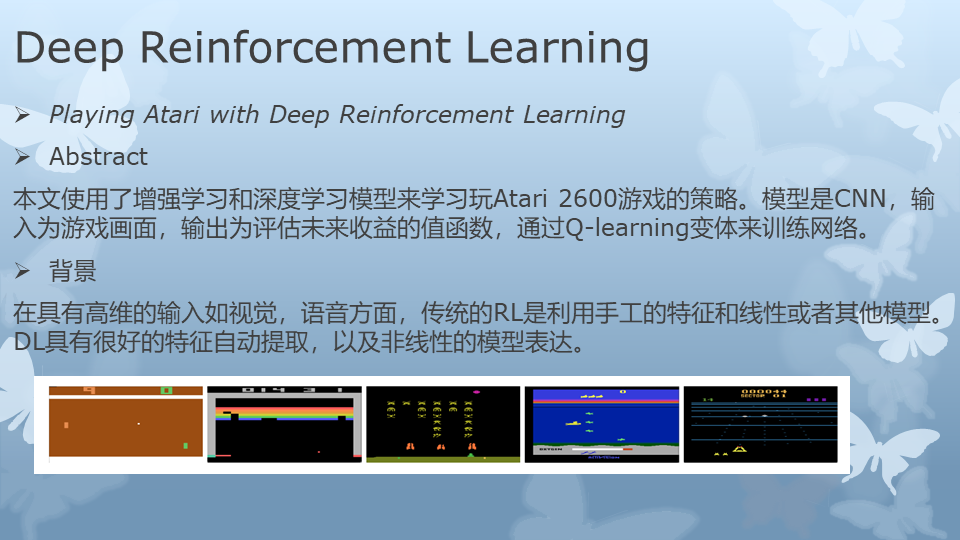
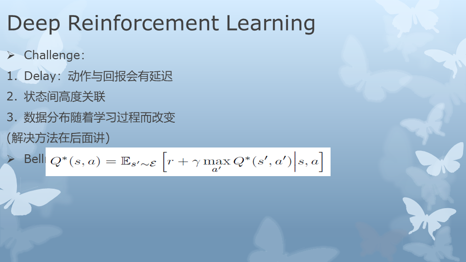
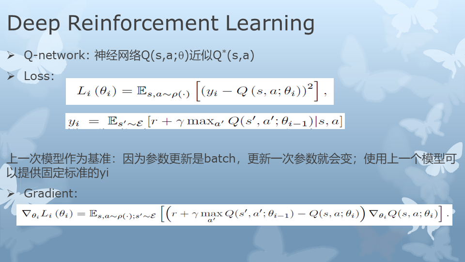
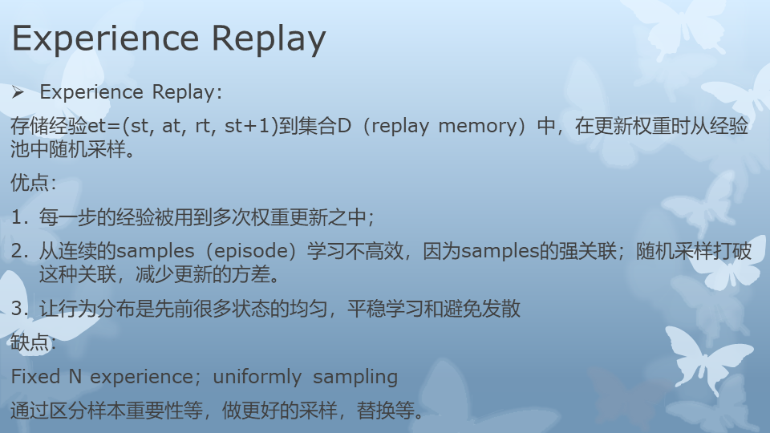
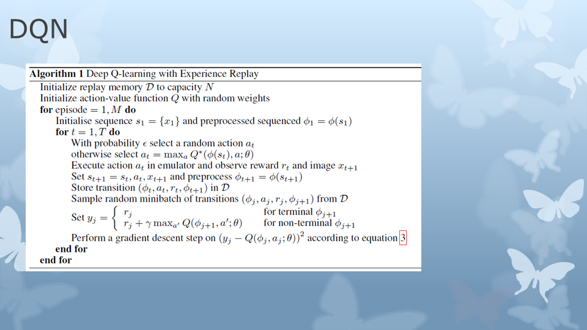
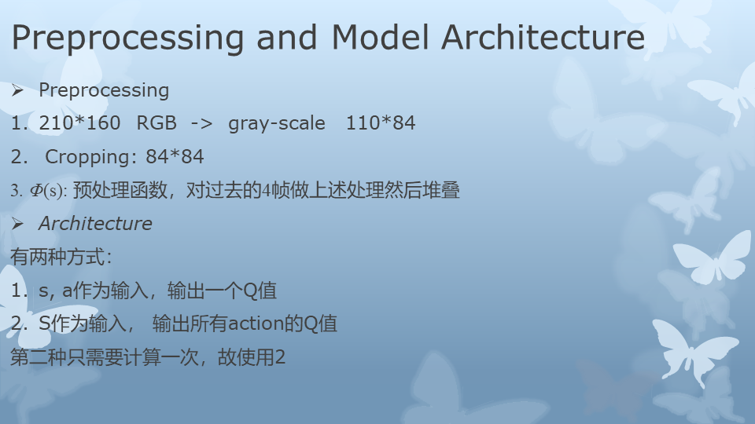
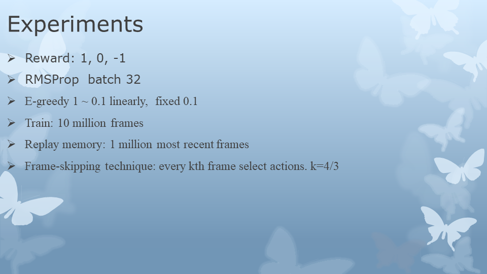
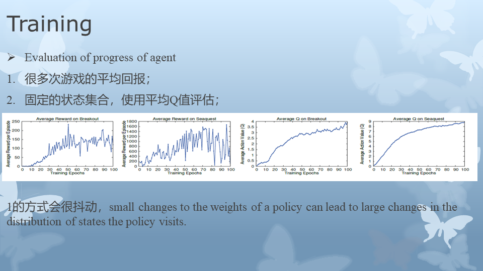
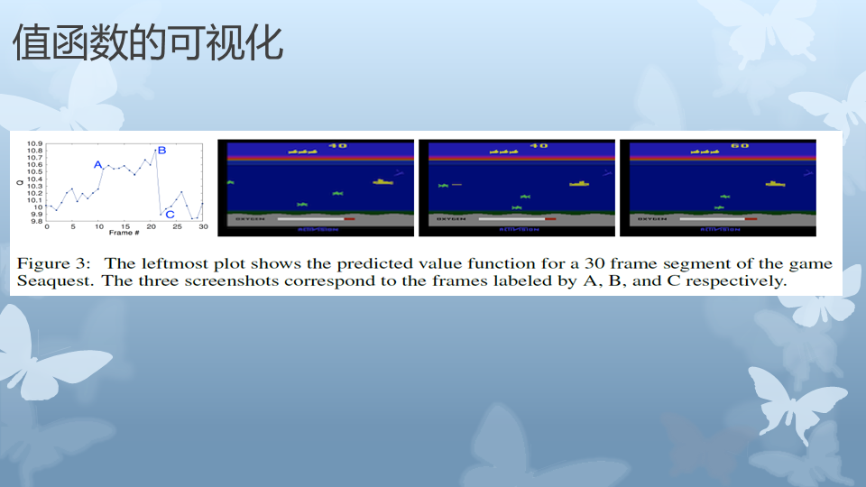
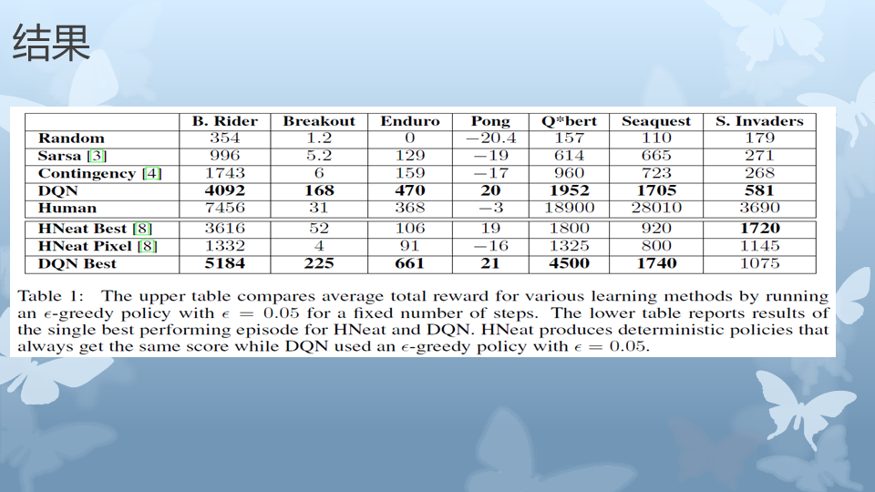

# Deep Q-Network(DQN)
这里介绍了deepmind在2013年提出的DQN，用来学习如何玩70年代美国电子游戏Atari。具体论文（[Playing Atari with Deep Reinforcement Learning](https://arxiv.org/abs/1312.5602) or [Human-level control through deep reinforcement learning](https://www.nature.com/articles/nature14236)）

