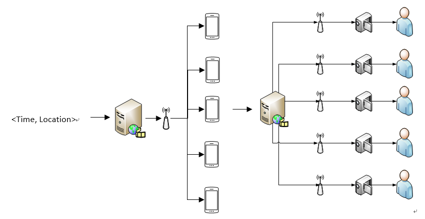

# Projects

## 融合多模态信息的行人识别与追踪

- 基于WiFi嗅探包解析的iwcap
- 基于HBase和Hadoop的基站和Wi-Fi数据分布式存储后端
- 基于Dahua NVR的视频监控与视频处理查询后端
- 融合多模态信息的轨迹追踪可视化后端
 
## 跨域融合的行人识别

（1）	集成Wi-Fi探针和摄像头监控设备的树莓派数据采集器。
结合图像与WiFi信息进行定位是该项目主要研究方向，所以再数据采集方面则需要图像与WiFi信息两种数据。如果将两种数据分别采集，不仅采集成本高，而且不易维护。树莓派数据采集器则集成了WiFi探针和摄像头监控设备，可以同时采集两种设备并且降低了维护成本。
（2）	基于Wi-Fi数据定位算法（不仅限于三角定位的）。 
    WiFi定位算法根据需求可分为不基于RSSI（TOA、TDOA、AOA等算法）与基于RSSI（三角定位算法、指纹算法、最大似然估算法等）两种类别。由于不基于RSSI的定位算法需要特殊的WiFi模块，而并非所有智能机都达到要求，所以主要的研究内容是基于RSSI的WiFi定位算法。
    三角定位算法需要通过预先设置好的AP进行数据采集，理论上采集到的AP数据越多，定位就越准确，基本定位原理如下图所示，但由于AP的位置和设备到AP的位置均为估算值，所以定位结果并非特别准确。
    指纹算法基于大量数据进行匹配的核心思想，当设备扫描周围的AP后，会将其BSSID序列全部采集并存储再数据库中，指向的是收集到该序列的坐标，当有其他设备采集到的BSSID序列能与之前采集到的匹配时，则可以认为此时的坐标是该序列指向的坐标。但是指纹算法也有其他缺点，如所需的数据采集量巨大、对服务端性能和数据存储要求高、在WiFi不密集的地方定位效果较差等。

（3）	基于行人再识别的图像匹配算法。
    行人再识别是利用计算机视觉技术判断图像或者视频中是否存在特定行人的技术，一般被认为是图像检索的子问题。主要为了弥补目前固定摄像头的视觉局限，并于行人检测或行人跟踪技术相结合。行人再识别有基于部件匹配的方法和基于损失函数的方法。
（4）	结合图像信息和Wi-Fi信息的定位算法。
    将图像信息与WiFi信息进行结合，需要同时使用图像匹配算法和WiFi定位算法对行人进行身份识别与锁定。图像匹配算法与WiFi定位算法相结合不仅提高了行人检测的准确性，也降低了算法代价和成本。
（5）室内行人行为的web前端可视化
使用HTML+CSS+JavaScript的方式实现室内行人行为分析系统的可视化web前端

## 基于融合多视图特征的养殖场动物智能识别与追踪
 
 
 
 - 基于MobileNet-SSD的动物检测
 - 基于运动规律的新对象发现与计数
 - 基于NCS的高性能神经网络运行
 
## 基于多尺度信息融合的汽车轨迹预测

## 基于多尺度信息融合的房产数据预测

## 基于多源异构信息融合的学术信息推荐

## 基于多源异构信息融合的智能学术助手

