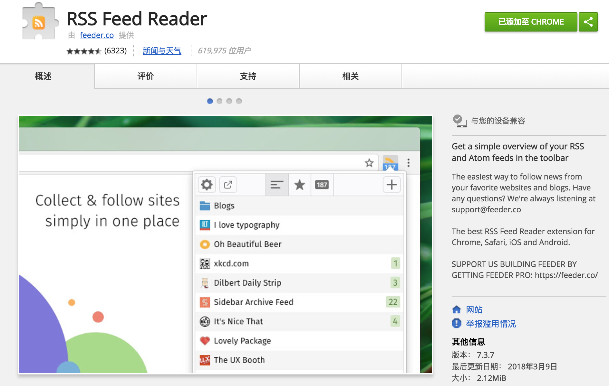
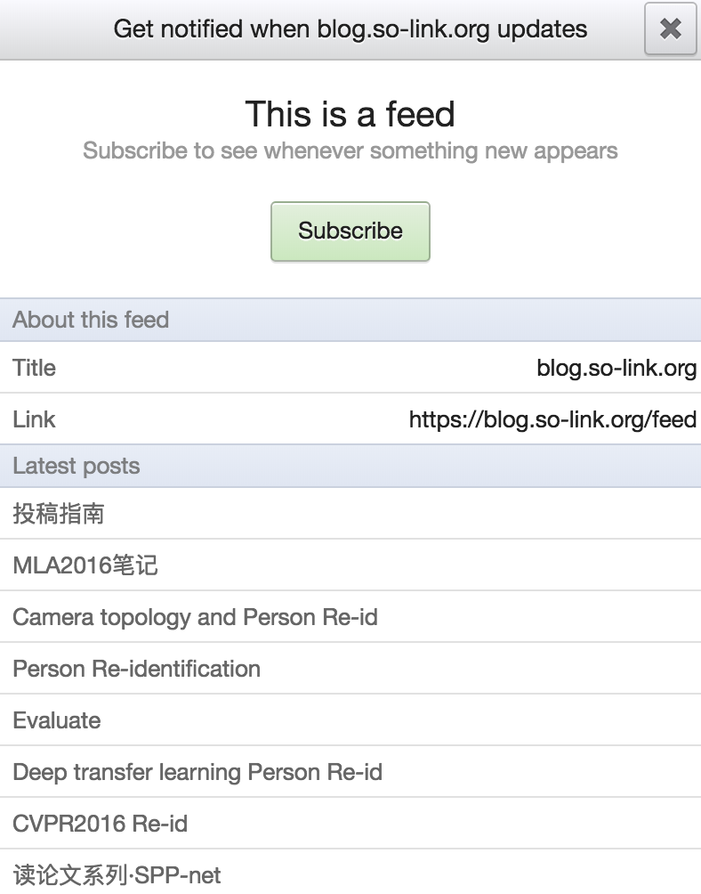
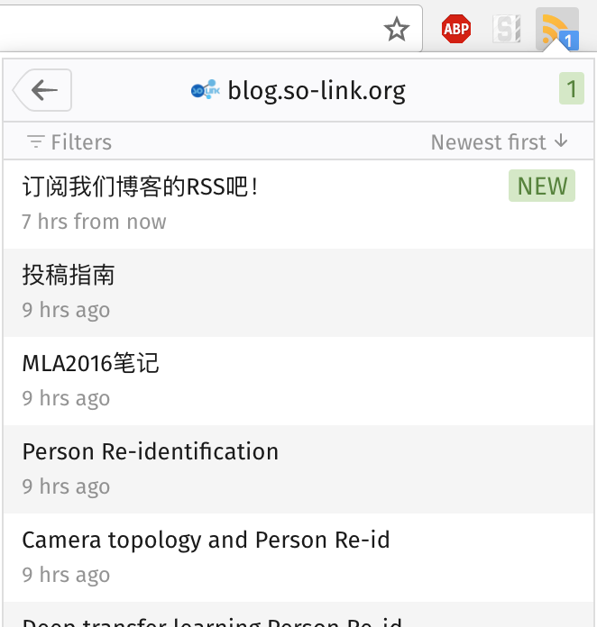

# 来订阅实验室博客的RSS吧！

安装这个Chrome插件[RSS Feed Reader](https://chrome.google.com/webstore/detail/rss-feed-reader/pnjaodmkngahhkoihejjehlcdlnohgmp?hl=zh-CN)

按住Ctrl，点击[博客的RSS订阅链接](https://blog.so-link.org/feed)，在新窗口中打开

插件会自动弹出一个提示框，然后点击**Subscribe**

每当新文章发布时你就会收到提醒啦

